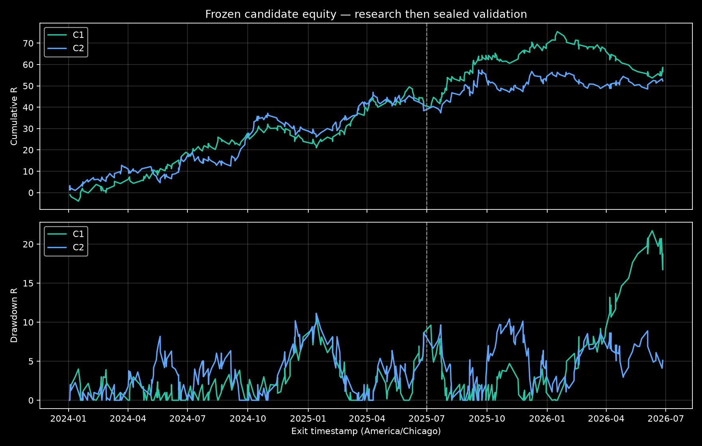

# Phase 17 — robust edge discovery and regime analysis

## Verdict

**C — PROMISING EDGE REQUIRES NEW OOS TEST**

The frozen aggregate CRT models remain weak: only BOS was slightly positive over the full history, at +6.29R and PF 1.006, while Control, Retest, and Confirm were negative. Two simple conditions discovered on the research segment remained positive on the sealed internal validation segment and after the declared conservative NQ cost assumption. That is encouraging conditional evidence, not proof of a robust edge: none of 260 adequately sampled hypotheses survived BH false-discovery correction, both validation expectancy confidence intervals include zero, and bootstrap sequence risk has a negative 5th-percentile terminal result. The correct next step is one untouched test on new history.

## 1. Immutable baseline gate

The Phase 17 rerun used the untouched Phase 16 engine and exact processed Databento continuous NQ file. The four-row model CSV and 6,363-row trade CSV hashes match Phase 16 exactly.

| model | N | wins | losses | avg_R | total_R | profit_factor | max_drawdown_R |
| --- | --- | --- | --- | --- | --- | --- | --- |
| Control | 2730 | 1122 | 1604 | -0.0095 | -25.86 | 0.982 | 51.00 |
| BOS | 1867 | 779 | 1087 | 0.0034 | 6.29 | 1.006 | 39.73 |
| Retest | 1061 | 429 | 629 | -0.0300 | -31.83 | 0.942 | 39.52 |
| Confirm | 705 | 289 | 415 | -0.0363 | -25.62 | 0.930 | 42.44 |

Baseline reproduction: **PASS**. Phase 16 was not overwritten.

## 2. Data separation and causal features

- Full descriptive history: 2024-01-01 through 2026-06-26, 176,022 five-minute bars, America/Chicago.
- Research: 2024-01-01 through 2025-06-30 inclusive.
- Validation: 2025-07-01 through 2026-06-26 inclusive.
- Candidate selection read research rows only. `frozen_candidates.json` and `FROZEN_CANDIDATES.md` were written before the one-time validation executable ran.
- Volatility is ATR(14)/close classified by shifted, trailing 17,280-bar 33rd/67th percentiles. Trend is the previous-closed 60-minute Phase 16 HTF regime. Full definitions are in `REGIME_DEFINITIONS.md`.
- `trade_features.csv` contains only entry-known features, including setup/BOS/retest timing, stop distance, entry-time volatility/trend/session, prior-bar CRT-boundary distance, volume context, and outcome.

## 3. Diagnostic map and multiple testing

All four models were mapped across direction, HTF regime, seven sessions, six requested score bands, date thirds, volatility, trend, and the six requested two-way intersections. Empty and small buckets remain in the CSV with N shown; N < 30 is labeled inadequate. Full outputs are `diagnostic_edge_map.csv`, `intersection_edge_map.csv`, `temporal_calendar.csv`, and `temporal_rolling.csv`.

There were 564 pre-specified descriptive subset rows and 260 with N >= 30 entering the inferential family. Six had uncorrected p < 0.05 and research bootstrap probability >= 95%; zero survived Benjamini-Hochberg FDR at q <= 0.10. Accordingly the frozen rules were labeled **statistically interesting**, never robust candidate edges.

## 4. Frozen candidates and robustness

### C1: Control — session_name = Premarket and direction_name = Short

- Research bootstrap P(expectancy > 0): 98.2%; bootstrap 95% CI [0.0201, 0.4034] R.
- Normal 95% expectancy CI: [0.0146, 0.3863] R; one-sided uncorrected p=0.0172; BH-FDR q=0.9928.
- Research halves: 25.74R then 15.16R. Removing the best five trades leaves 30.90R; removing the best month leaves 32.93R.
- Research profitable months: 77.8%; profitable quarters: 83.3%. Worst quarter 2024Q4 (-1.77R); best quarter 2025Q1 (15.20R).
- Validation profitable months: 7/12 (58.3%); profitable quarters: 2/4. Worst quarter 2026Q2 (-9.52R); best quarter 2025Q3 (22.37R); longest losing run 4 month(s).
### C2: BOS — direction_name = Short and score_band = 90-94

- Research bootstrap P(expectancy > 0): 96.8%; bootstrap 95% CI [-0.0108, 0.3407] R.
- Normal 95% expectancy CI: [-0.0051, 0.3399] R; one-sided uncorrected p=0.0286; BH-FDR q=0.9928.
- Research halves: 26.49R then 11.84R. Removing the best five trades leaves 28.33R; removing the best month leaves 25.34R.
- Research profitable months: 61.1%; profitable quarters: 83.3%. Worst quarter 2025Q2 (-3.10R); best quarter 2024Q1 (12.02R).
- Validation profitable months: 8/12 (66.7%); profitable quarters: 3/4. Worst quarter 2026Q1 (-5.56R); best quarter 2025Q3 (14.07R); longest losing run 2 month(s).

The two candidates are correlated, not independent confirmations: BOS opportunities are downstream of the same CRT setup framework used by Control. No score, entry, stop, target, session, HTF, cooldown, anti-chase, expiry, or execution rule was tuned.

## 5. One-time internal validation

| candidate_id | model | research_N | research_avg_R | research_total_R | research_profit_factor | research_max_drawdown_R | validation_N | validation_avg_R | validation_total_R | validation_profit_factor | validation_max_drawdown_R |
| --- | --- | --- | --- | --- | --- | --- | --- | --- | --- | --- | --- |
| C1 | Control | 204 | 0.2005 | 40.90 | 1.387 | 11.10 | 153 | 0.1032 | 15.79 | 1.184 | 21.71 |
| C2 | BOS | 229 | 0.1674 | 38.33 | 1.317 | 11.14 | 150 | 0.0931 | 13.97 | 1.179 | 10.41 |

Both candidates degraded from research to validation but retained positive ideal expectancy. Validation was not used to revise either rule.

## 6. NQ transaction-cost stress

NQ assumptions use $20/point and $5/tick. Modest cost is one tick of slippage per side plus $4.50 round-turn commission ($14.50/trade). Conservative cost is two ticks per side plus $8.00 round-turn commission ($28/trade). Cost is converted trade-by-trade using the frozen ATR stop risk in dollars.

| candidate_id | scenario | all_in_cost_usd_per_trade | avg_R | total_R | profit_factor | max_drawdown_R | break_even_all_in_cost_usd_per_trade |
| --- | --- | --- | --- | --- | --- | --- | --- |
| C1 | Ideal/current | $0.00 | 0.1032 | 15.79 | 1.184 | 21.71 | $48.38 |
| C1 | Modest | $14.50 | 0.0723 | 11.06 | 1.125 | 22.69 | $48.38 |
| C1 | Conservative | $28.00 | 0.0435 | 6.65 | 1.073 | 23.60 | $48.38 |
| C2 | Ideal/current | $0.00 | 0.0931 | 13.97 | 1.179 | 10.41 | $34.43 |
| C2 | Modest | $14.50 | 0.0539 | 8.09 | 1.100 | 12.68 | $34.43 |
| C2 | Conservative | $28.00 | 0.0174 | 2.61 | 1.031 | 16.22 | $34.43 |

Both candidates remain positive under the conservative assumption, but C2 has only a small validation cushion (+2.61R, PF 1.031). Break-even values are average all-in dollar costs per trade implied by the exact risk sizes, not guarantees of live fill quality.

## 7. Bootstrap / Monte Carlo sequence risk

The sequence analysis resamples observed validation returns with replacement; it does not invent returns. Percentiles below are terminal Total R over the same validation trade count.

| candidate_id | p05 | p25 | median | p75 | p95 | probability_terminal_positive |
| --- | --- | --- | --- | --- | --- | --- |
| C1 | -11.16 | 4.09 | 15.79 | 27.43 | 44.21 | 82.4% |
| C2 | -10.87 | 3.36 | 13.61 | 24.30 | 40.52 | 81.7% |

The 5th percentile is negative for both candidates and terminal-positive probability is only about 82%. Full Max DD and losing-streak percentiles are in `monte_carlo.csv`.

## 8. Required research answers

1. **Does the original CRT framework contain evidence of an edge?** Conditional evidence exists, but aggregate evidence is weak and no condition survived FDR correction.
2. **Strongest model?** Control has the strongest conditional evidence; BOS is the strongest aggregate model but only marginally positive.
3. **Strongest condition?** Control short setups during Premarket (C1).
4. **Stable through time?** Partly. Both research halves and the sealed validation year were positive, but losing periods and negative 5th-percentile outcomes remain.
5. **Survives costs?** Yes under the declared modest and conservative assumptions, narrowly for C2.
6. **Survives internal validation?** Yes in point estimates for both candidates, with degraded Avg R and PF.
7. **Adequate sample?** Reasonable for screening (C1: 204 research/153 validation; C2: 229/150), but not enough for narrow confidence intervals.
8. **Robust or data-mined?** Promising but exposed to data-mining risk. No BH-FDR significance and correlated model evidence prevent a robust claim.
9. **Next action?** Freeze C1 and C2 exactly and test once on genuinely unseen NQ history, preferably 2022-01-01 through 2023-11-29 or a future post-2026-08-18 holdout. Do not alter the rules after seeing that result.

## Completion record

- BASELINE REPRODUCTION: PASS
- HYPOTHESES TESTED: 260 adequately sampled (564 descriptive rows enumerated)
- STRONGEST MODEL: Control (conditional); BOS (aggregate)
- STRONGEST CONDITION: Control + Short + Premarket
- RESEARCH RESULT: C1 +40.90R, PF 1.387; C2 +38.33R, PF 1.317
- VALIDATION RESULT: C1 +15.79R, PF 1.184; C2 +13.97R, PF 1.179
- COST-STRESS RESULT: Conservative C1 +6.65R/PF 1.073; C2 +2.61R/PF 1.031
- MONTE CARLO RESULT: Negative 5th-percentile terminal R for both; P(terminal > 0) C1 82.4%, C2 81.7%
- PHASE 17 CLASSIFICATION: C — PROMISING EDGE REQUIRES NEW OOS TEST
- RECOMMENDED NEXT STEP: one untouched, pre-registered test on new NQ history; no rule changes
